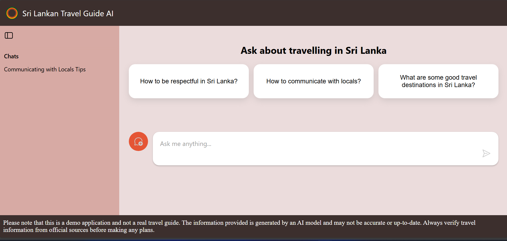

# Travel Guide for Sri Lanka - Chatbot



<video controls width="600">
<source src="./assets/video.mp4" type="video/mp4">
</video>

A serverless AI travel assistant that answers questions about Sri Lankan tourism using Retrieval-Augmented Generation (RAG) with LangChain.js, Azure AI, and PDF-based travel documents.

Live demo : https://brave-mushroom-070b6770f.1.azurestaticapps.net/

# 📋 Prerequisites

- Node.js 20+ and npm
- Python 3.11+ and pip
- Azure subscription
- Git

# 🛠️Deployment Guide

- Deploy to Azure
```
# Clone the repository
git clone  https://github.com/senadhi-Thimanya/AI-Travel-Guide-for-Sri-Lanka.git

# Authenticate with Azure
azd auth login

# Deploy to Azure
azd up
```
- Remember to delete resources afterwards
```
azd down
```

# Sources

All sources are stored in the data folder

# License

MIT License
